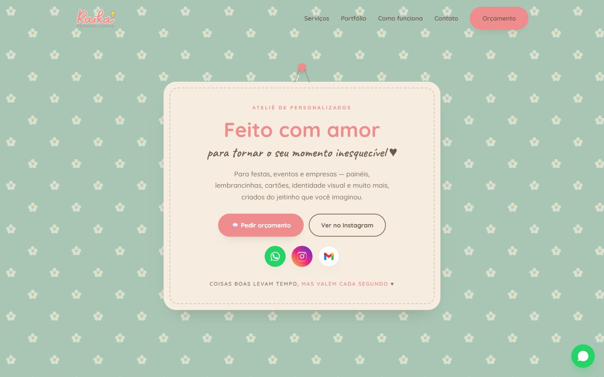

  

<h1 align="center">Nataniel Wilson</h1>

  Pode me chamar de <strong>NWOAN</strong> ou <strong>Natanashi</strong>.

  
  

---

## Sobre mim

Meu nome é Nataniel Wilson. Gosto de aprender colocando a mão no código e vendo uma ideia sair do papel até funcionar de verdade no navegador.

Ainda estou construindo meu caminho como desenvolvedor, então este perfil também é um registro dessa evolução. Cada repositório representa alguma coisa que eu quis entender melhor, testar ou transformar em algo que outras pessoas pudessem usar.

Tenho um carinho especial por interfaces bem cuidadas, experiências interativas e detalhes que fazem um projeto parecer vivo. Às vezes começo com uma ideia simples e vou melhorando aos poucos, corrigindo o que não ficou bom e aprendendo durante o processo.

## O que gosto de fazer

Gosto de criar para a web, trabalhar em interfaces que funcionem bem no computador e no celular e experimentar com animações, jogos e ideias visuais. Também me interesso pela parte mais estrutural dos projetos: organizar o código e conectar dados.

## Experiência profissional

<table width="68%" align="center">
  <tr>
    <td valign="top">
      
      <h3 align="center">Raika Personalizados</h3>
      
Desenvolvi o site da <strong>Raika Personalizados</strong>, empresa de cartões, topos de bolo, painéis, lembrancinhas, adesivos, etiquetas e outros produtos sob encomenda.

      
Organizei a identidade visual, o catálogo, o portfólio e os caminhos de contato em uma experiência responsiva para computador e celular.

      

        <a href="https://natanashi.github.io/raika-personalizados/"><strong>Visitar o site</strong></a>
        &nbsp;·&nbsp;
        <a href="https://github.com/natanashi/raika-personalizados"><strong>Repositório</strong></a>
      

    </td>
  </tr>
</table>

## Jogo em desenvolvimento

<table width="68%" align="center">
  <tr>
    <td valign="top">
      
      <h3 align="center">Sapo do Chapéu de Palha — versão beta</h3>
      
A versão do navegador é uma <strong>beta</strong> para testar jogabilidade, cenários, inimigos e progressão. A versão oficial será lançada para <strong>Steam</strong> e <strong>Play Store</strong>.

      

        <a href="https://natanashi.github.io/sapo_do_chapeu_de_palha/"><strong>Jogar a beta</strong></a>
        &nbsp;·&nbsp;
        <a href="https://github.com/natanashi/sapo_do_chapeu_de_palha"><strong>Repositório</strong></a>
      

    </td>
  </tr>
</table>

## Ferramentas que fazem parte do meu caminho

  
  
  
  
  
  
  
  
  

---

  Obrigado por passar por aqui. Se quiser acompanhar o que estou criando além do GitHub, me encontre no
  <a href="https://www.instagram.com/nataniel_wilson_/">Instagram</a>.

